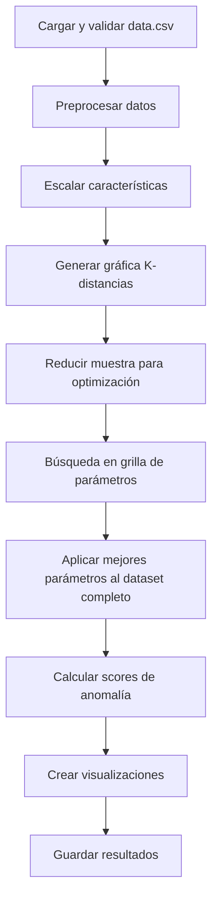

# 🎯 Algoritmo DBSCAN para Mantenimiento Predictivo

## 📋 Descripción General

Este módulo implementa el algoritmo **DBSCAN** (Density-Based Spatial Clustering of Applications with Noise) para clustering de datos de acelerómetro, diseñado específicamente para mantenimiento predictivo. El algoritmo identifica clusters de densidad variable y detecta automáticamente puntos de ruido (anomalías).

## 🔬 ¿Qué es DBSCAN?

**DBSCAN** es un algoritmo de clustering basado en densidad que:
- **No requiere especificar K** (número de clusters) de antemano
- **Detecta automáticamente ruido** (puntos anómalos)
- **Encuentra clusters de formas arbitrarias** (no solo circulares)
- **Identifica regiones densas** separadas por regiones de baja densidad

### 🎯 Conceptos Clave
- **Punto Núcleo**: Tiene al menos `min_samples` vecinos dentro de radio `eps`
- **Punto Frontera**: No es núcleo pero está cerca de uno
- **Ruido**: Puntos aislados que no pertenecen a ningún cluster
- **Cluster**: Grupo de puntos núcleo conectados + sus fronteras

### 🚨 Aplicación en PdM
- **Operación Normal**: Clusters densos de condiciones típicas
- **Anomalías**: Puntos de ruido (outliers automáticos)
- **Condiciones Especiales**: Clusters pequeños de eventos específicos
- **Detección Automática**: No necesita conocer tipos de fallas de antemano

## ⚙️ Características del Código

### 🔧 Capacidades Principales
- ✅ **Optimización automática de parámetros** (eps y min_samples)
- ✅ **Gráfica K-distancias** para estimación de eps
- ✅ **Búsqueda en grilla** paralela para mejores parámetros
- ✅ **Métricas de calidad** excluyendo ruido correctamente
- ✅ **Scores de anomalía** para todos los puntos (incluido ruido)
- ✅ **Visualizaciones 2D y 3D** distinguiendo ruido de clusters
- ✅ **Optimización de memoria** para datasets grandes

### 🛠️ Correcciones Implementadas
- **🔴 Score de Anomalía Agregado**: Ahora calcula distancia a puntos núcleo para todos los puntos
- **📊 Outputs Estandarizados**: Genera `anomaly_score`, `is_outlier`, `cluster_id`
- **📈 Métricas Correctas**: Excluye ruido apropiadamente en cálculos de silhouette
- **💾 Archivos Estandarizados**: `scores_dbscan.csv` y `anomalies.csv` compatibles

## 📊 Datos de Entrada

### 📄 Archivo Requerido
- **Nombre**: `data.csv`
- **Ubicación**: Misma carpeta que el script
- **Formato**: CSV con headers

### 📝 Columnas Requeridas
```csv
acceleration_x,acceleration_y,acceleration_z
1.2,0.8,9.8
1.1,0.9,9.9
2.5,1.5,8.2
```

### 🧮 Características Generadas
El código automáticamente calcula:
- **Magnitud de aceleración**: `√(x² + y² + z²)`
- **Características finales**: [x, y, z, magnitud]

## 🚀 Cómo Ejecutar

### 📋 Requisitos
```bash
pip install numpy pandas scikit-learn matplotlib joblib h5py
```

### ⚡ Ejecución
```bash
# Desde la carpeta del algoritmo
cd "1. Clustering/DBSCAN"
python DBSCAN.py
```

### 🔧 Parámetros Principales
```python
# Búsqueda de parámetros (en el código)
PARAM_GRID = {
    'eps': [0.1, 0.3, 0.5, 0.8, 1.0, 1.5, 2.0],      # Radio de vecindad
    'min_samples': [3, 4]                               # Mín. puntos para cluster
}

# Optimización de memoria
MAX_MUESTRAS_OPTIMIZACION = 10000  # Reducir para datasets grandes
N_JOBS_PARALELO = 1                 # Procesos paralelos
```

## 📂 Estructura del Código

### 🏗️ Arquitectura Modular

#### 📁 Clases Principales

| Clase | Propósito | Responsabilidad |
|-------|-----------|-----------------|
| `GestorDirectorios` | 📁 Organización | Crear y gestionar directorios de salida |
| `ProcesadorDatos` | 📄 Preprocesamiento | Cargar, limpiar y escalar datos |
| `AnalizadorDistancias` | 📊 Análisis | Generar gráfica K-distancias |
| `OptimizadorDBSCAN` | 🎯 Optimización | Búsqueda de mejores parámetros |
| `DetectorAnomalias` | 🚨 Detección | Calcular scores y identificar anomalías |
| `VisualizadorClusters` | 📈 Visualización | Crear gráficos 2D y 3D |
| `GuardadorModelos` | 💾 Persistencia | Guardar modelos y resultados |

#### 🔄 Flujo de Ejecución


### 🎯 Optimización de Parámetros

#### 📊 Estimación de eps
1. **K-distance graph**: Distancia al k-ésimo vecino más cercano
2. **Método del codo**: Buscar cambio abrupto en la curva
3. **Grilla de búsqueda**: Evaluar múltiples valores alrededor del estimado

#### 🔍 Selección de min_samples
- **Regla general**: `min_samples = dimensiones + 1`
- **Para 4 dimensiones**: min_samples = 3-5
- **Evaluación**: Silhouette score excluyendo ruido

## 📁 Archivos Generados

### 📊 Métricas y Resultados
```
metricas_DBSCAN/
├── metrics.txt              # Métricas en formato texto
├── scores_dbscan.csv        # ✅ Todos los datos con scores y clusters
├── anomalies.csv            # ✅ Solo anomalías detectadas (ruido)
└── output.log               # Log detallado de ejecución
```

### 📈 Visualizaciones
```
graficas_DBSCAN/
├── k_distance_graph.png     # Gráfica K-distancias para estimar eps
├── clusters_2d_pca.png      # Clusters en 2D (PCA) con ruido en negro
└── clusters_3d_pca.png      # Clusters en 3D (PCA) con ruido marcado
```

### 🤖 Modelos Entrenados
```
modelos_entrenados_DBSCAN/
├── dbscan_model.pkl         # Modelo en formato pickle
└── dbscan_model.h5          # Datos del modelo en HDF5
```

## 📊 Formato de Outputs

### 📄 scores_dbscan.csv (Principal)
```csv
acceleration_x,acceleration_y,acceleration_z,magnitud_aceleracion,anomaly_score,is_outlier,cluster_id
1.2,0.8,9.8,9.85,0.0,0,0
1.1,0.9,9.9,9.92,0.0,0,0
2.5,1.5,8.2,8.59,1.456,1,-1
```

### 🚨 anomalies.csv (Solo Anomalías)
```csv
acceleration_x,acceleration_y,acceleration_z,magnitud_aceleracion,anomaly_score,is_outlier,cluster_id
2.5,1.5,8.2,8.59,1.456,1,-1
3.1,2.2,7.8,8.94,1.789,1,-1
```

### 📊 metrics.txt (Resultados)
```
=== MEJORES RESULTADOS ===
Parámetros óptimos: eps=0.500, min_samples=4
Clusters encontrados: 3
Puntos de ruido: 23
Coeficiente Silhouette: 0.7234
Calinski-Harabasz: 1456.78
Davies-Bouldin: 0.892
```

## 🎯 Interpretación de Resultados

### 📊 Parámetros Finales

| Parámetro | Significado | Interpretación |
|-----------|-------------|----------------|
| **eps** | Radio de vecindad | Distancia máxima para considerar vecinos |
| **min_samples** | Mínimo puntos por cluster | Densidad mínima requerida |
| **n_clusters** | Clusters encontrados | Modos operativos identificados |
| **n_ruido** | Puntos de ruido | Anomalías detectadas automáticamente |

### 🚨 Scores de Anomalía
- **Puntos núcleo**: `anomaly_score = 0.0` (más normales)
- **Puntos frontera**: `anomaly_score` = distancia a núcleo más cercano
- **Ruido**: `anomaly_score` = distancia a núcleo más cercano (alta)

### 🎨 Identificación de Clusters
- **cluster_id ≥ 0**: Pertenece a cluster específico
- **cluster_id = -1**: Ruido (anomalía automática)
- **is_outlier = 1**: Punto clasificado como anomalía

## ⚙️ Configuración Avanzada

### 🔧 Optimización de Memoria
```python
# Para datasets grandes (>100k puntos)
MAX_MUESTRAS_OPTIMIZACION = 5000   # Reducir muestra para optimización
N_JOBS_PARALELO = 1                 # Usar 1 proceso para evitar memoria

# Para sistemas con más recursos
MAX_MUESTRAS_OPTIMIZACION = 20000  # Aumentar para mejor optimización
N_JOBS_PARALELO = 4                 # Usar más procesos
```

### 🎯 Ajuste de Grilla de Búsqueda
```python
# Búsqueda más amplia (más tiempo, mejores resultados)
PARAM_GRID = {
    'eps': np.linspace(0.1, 3.0, 20),     # 20 valores de eps
    'min_samples': [3, 4, 5, 6, 7]        # Más opciones min_samples
}

# Búsqueda rápida (menos tiempo, resultados básicos)
PARAM_GRID = {
    'eps': [0.3, 0.5, 0.8],               # Solo 3 valores
    'min_samples': [3, 4]                  # Solo 2 opciones
}
```

### 📊 Control de Calidad
```python
MIN_CLUSTERS_VALIDOS = 2    # Mínimo clusters para considerar válido
```

## 🚨 Casos de Uso y Limitaciones

### ✅ Casos Ideales
- **Detección automática de anomalías**: No requiere conocer tipos de fallas
- **Clusters de formas irregulares**: Mejor que K-Means para formas complejas
- **Datos con ruido**: Maneja automáticamente puntos atípicos
- **Número desconocido de condiciones**: No necesita especificar K

### ⚠️ Limitaciones
- **Sensible a parámetros**: eps y min_samples afectan mucho los resultados
- **Densidad variable**: Problemas si clusters tienen densidades muy diferentes
- **Dimensiones altas**: Performance se degrada con muchas características
- **Interpretación de parámetros**: eps depende de la escala de los datos

### 🎯 Cuándo Usar DBSCAN
- ✅ No sabes cuántos tipos de condiciones operativas existen
- ✅ Quieres detección automática de anomalías
- ✅ Los clusters pueden tener formas irregulares
- ✅ Hay presencia de ruido/outliers en los datos
- ✅ Necesitas identificar regiones de operación densa vs esparcida

## 🔗 Integración con Sistema Completo

### 📊 Compatibilidad
- **Outputs estandarizados** para `sistema_comparacion_algoritmos.py`
- **Scores normalizados** para sistema de severidad unificado
- **Detección binaria** de anomalías automática

### 🔄 En Pipeline de PdM
1. **Entrenamiento**: Identificar regiones de operación normal (clusters)
2. **Detección en tiempo real**: Nuevos puntos clasificados como cluster o ruido
3. **Alertas automáticas**: Puntos de ruido = anomalías inmediatas
4. **Monitoreo de deriva**: Cambios en distribución de clusters

## 🛠️ Troubleshooting

### ❌ Errores Comunes

#### "No se encontraron parámetros que generen clusters válidos"
```python
# Solución 1: Ampliar rango de búsqueda
eps_min = 0.05    # Reducir mínimo
eps_max = 5.0     # Aumentar máximo

# Solución 2: Reducir MIN_CLUSTERS_VALIDOS
MIN_CLUSTERS_VALIDOS = 1
```

#### "Todos los puntos clasificados como ruido"
- **Causa**: eps muy pequeño
- **Solución**: Revisar gráfica K-distancias, aumentar eps

#### "Un solo cluster gigante"
- **Causa**: eps muy grande
- **Solución**: Reducir eps, revisar distribución de datos

#### "MemoryError durante optimización"
```python
# Reducir tamaño de muestra
MAX_MUESTRAS_OPTIMIZACION = 5000
N_JOBS_PARALELO = 1
```

### 📊 Validación de Resultados
```python
# Verificar que hay clusters válidos
assert metricas['n_clusters'] >= 2, "Muy pocos clusters"
assert metricas['n_ruido'] < len(datos) * 0.5, "Demasiado ruido"

# Verificar archivos generados
import os
assert os.path.exists('metricas_DBSCAN/scores_dbscan.csv')
assert os.path.exists('graficas_DBSCAN/k_distance_graph.png')
```

### 🔍 Interpretación de K-distance
```python
# En la gráfica K-distancias buscar:
# 1. Codo pronunciado = buen valor de eps
# 2. Pendiente gradual = rango de eps válido
# 3. Salto abrupto = límite entre cluster y ruido
```

## 🧠 Algoritmo DBSCAN - Detalles Técnicos

### 🔬 Pseudocódigo Simplificado
```python
def dbscan(datos, eps, min_samples):
    for cada_punto in datos:
        if punto.visitado:
            continue
        
        vecinos = encontrar_vecinos(punto, eps)
        
        if len(vecinos) < min_samples:
            marcar_como_ruido(punto)
        else:
            crear_cluster(punto, vecinos, eps, min_samples)
```

### ⚡ Complejidad
- **Tiempo**: O(n²) en el peor caso, O(n log n) con índices espaciales
- **Espacio**: O(n) para almacenar clusters y visitados
- **Escalabilidad**: Buena para datasets medianos (<100k puntos)

### 🎯 Ventajas vs K-Means

| Aspecto | DBSCAN | K-Means |
|---------|--------|---------|
| **Número de clusters** | Automático | Manual (K) |
| **Formas de clusters** | Arbitrarias | Esféricas |
| **Detección de ruido** | Automática | No |
| **Interpretabilidad** | Media | Alta |
| **Velocidad** | Media | Rápida |

## 📚 Referencias y Recursos

### 📖 Algoritmo DBSCAN
- **Paper Original**: Ester, M. et al. (1996). "A density-based algorithm for discovering clusters"
- **Scikit-learn**: [DBSCAN Documentation](https://scikit-learn.org/stable/modules/clustering.html#dbscan)

### 📊 Métricas y Validación
- **Silhouette**: Para evaluar calidad de clustering
- **K-distance**: Para estimación de parámetro eps
- **Adjusted Rand Index**: Para comparar particiones

### 🔧 Aplicaciones en PdM
- **Bearing Fault Detection**: Using vibration data clustering
- **Anomaly Detection**: In industrial sensor networks
- **Condition Monitoring**: Pattern recognition in mechanical systems

---

## 🎯 Resumen Ejecutivo

Este módulo DBSCAN ofrece:
- ✅ **Detección automática** de clusters y anomalías
- ✅ **Optimización inteligente** de parámetros críticos
- ✅ **Manejo robusto** de ruido y outliers
- ✅ **Scores de anomalía** para todos los puntos
- ✅ **Visualizaciones claras** distinguiendo clusters de ruido

**Ideal para**: Detección automática de anomalías, descubrimiento de patrones desconocidos, y manejo de datos con ruido natural.

**Ventaja clave**: No requiere conocimiento previo del número de condiciones operativas, detecta automáticamente anomalías como ruido.

---

*Desarrollado para mantenimiento predictivo con detección automática de anomalías*  
*Versión corregida y optimizada - Lista para producción* ✅
