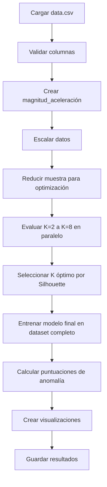

# 🎯 Algoritmo K-Means para Mantenimiento Predictivo

## 📋 Descripción General

Este módulo implementa el algoritmo **K-Means** para clustering de datos de acelerómetro, diseñado específicamente para mantenimiento predictivo. El algoritmo identifica patrones operativos normales y calcula puntuaciones de anomalía basadas en la distancia a los centroides de clusters.

## 🔬 ¿Qué es K-Means?

**K-Means** es un algoritmo de clustering no supervisado que:
- Divide los datos en **K clusters** (grupos)
- Cada cluster tiene un **centroide** (punto central)
- Los puntos se asignan al cluster con el centroide más cercano
- Es ideal para identificar **modos de operación** diferentes en maquinaria

### 🎯 Aplicación en PdM
- **Operación Normal**: Puntos cerca de centroides
- **Anomalías**: Puntos lejos de todos los centroides
- **Patrones**: Diferentes clusters = diferentes condiciones operativas

## ⚙️ Características del Código

### 🔧 Capacidades Principales
- ✅ **Detección automática de K óptimo** usando Silhouette Score
- ✅ **Optimización de memoria** para datasets grandes
- ✅ **Múltiples métricas de evaluación** (Silhouette, Calinski-Harabasz, Davies-Bouldin)
- ✅ **Visualizaciones 2D y 3D** con PCA
- ✅ **Cálculo de puntuaciones de anomalía** para cada punto
- ✅ **Outputs estandarizados** compatibles con sistema de comparación

### 🛠️ Correcciones Implementadas
- **🔴 Bug Crítico Corregido**: Ahora usa `kmeans_final.labels_` en lugar de labels del dataset reducido
- **📊 Métricas Recalculadas**: Métricas finales calculadas en el dataset completo
- **📝 Outputs Estandarizados**: Genera `anomaly_score`, `is_outlier`, `cluster_id`
- **📈 CSV de Métricas**: Archivo `metrics.csv` para comparación entre algoritmos

## 📊 Datos de Entrada

### 📄 Archivo Requerido
- **Nombre**: `data.csv`
- **Ubicación**: Misma carpeta que el script
- **Formato**: CSV con headers

### 📝 Columnas Requeridas
```csv
acceleration_x,acceleration_y,acceleration_z
1.2,0.8,9.8
1.1,0.9,9.9
1.3,0.7,9.7
```

### 🧮 Características Generadas
El código automáticamente calcula:
- **Magnitud de aceleración**: `√(x² + y² + z²)`
- **Características finales**: [x, y, z, magnitud]

## 🚀 Cómo Ejecutar

### 📋 Requisitos
```bash
pip install numpy pandas scikit-learn matplotlib joblib h5py
```

### ⚡ Ejecución
```bash
# Desde la carpeta del algoritmo
cd "1. Clustering/K-means"
python K-means.py
```

### 🔧 Configuración de Parámetros
```python
# En el código (constantes al inicio)
K_MIN = 2          # Mínimo número de clusters a evaluar
K_MAX = 8          # Máximo número de clusters a evaluar
RANDOM_STATE = 42  # Semilla para reproducibilidad
N_JOBS = 2         # Procesos paralelos (ajustar según CPU)
```

## 📂 Estructura del Código

### 🏗️ Clase Principal: `KMeansAnalyzer`

#### 📁 Métodos Principales

| Método | Propósito | Descripción |
|--------|-----------|-------------|
| `cargar_datos()` | 📄 Carga de datos | Lee CSV, valida columnas, maneja encoding |
| `escalar_datos()` | 📏 Normalización | StandardScaler para normalizar características |
| `encontrar_k_optimo()` | 🎯 Optimización | Evalúa K=2 a K=8, selecciona por Silhouette |
| `entrenar_modelo_final()` | 🏆 Modelo final | Entrena K-Means con K óptimo |
| `calcular_puntuaciones_anomalia()` | 📊 Scoring | Calcula distancias a centroides |
| `crear_visualizaciones()` | 📈 Gráficos | PCA 2D/3D para visualización |
| `guardar_resultados()` | 💾 Outputs | Guarda modelos, métricas y scores |

#### 🔄 Flujo de Ejecución


## 📁 Archivos Generados

### 📊 Métricas y Resultados
```
metricas_KMeans/
├── metrics.txt           # Métricas en formato texto
├── metrics.csv          # ✅ Métricas estandarizadas para comparación
├── scores_kmeans.csv    # ✅ Todos los datos con scores
└── output.log           # Log detallado de ejecución
```

### 📈 Visualizaciones
```
graficas_KMeans/
├── elbow_method.png           # Método del codo (inercia vs K)
├── silhouette_scores.png      # Silhouette score vs K
├── calinski_harabasz_scores.png # Calinski-Harabasz vs K
├── davies_bouldin_scores.png  # Davies-Bouldin vs K
├── clusters_pca.png           # Clusters en 2D (PCA)
├── anomalies_pca.png          # Mapa de calor de anomalías 2D
└── clusters_3d.png            # Clusters en 3D (PCA)
```

### 🤖 Modelos Entrenados
```
modelos_entrenados_KMeans/
├── kmeans_model.pkl     # Modelo en formato pickle
└── kmeans_model.h5      # Datos del modelo en HDF5
```

## 📊 Formato de Outputs

### 📄 scores_kmeans.csv (Principal)
```csv
acceleration_x,acceleration_y,acceleration_z,magnitud_aceleracion,anomaly_score,is_outlier,cluster_id
1.2,0.8,9.8,9.85,0.234,0,2
1.1,0.9,9.9,9.92,0.189,0,2
2.5,1.5,8.2,8.59,1.456,0,1
```

### 📊 metrics.csv (Para Comparación)
```csv
algoritmo,k_clusters,silhouette_score,calinski_harabasz_score,davies_bouldin_score,inertia,n_anomalias,porcentaje_anomalias,media_anomaly_score
K-Means,3,0.7234,1456.78,0.892,2345.67,0,0.0,0.3456
```

## 🎯 Interpretación de Resultados

### 📊 Métricas de Calidad

| Métrica | Rango | Mejor | Interpretación |
|---------|-------|-------|----------------|
| **Silhouette Score** | [-1, 1] | Mayor | Qué tan bien separados están los clusters |
| **Calinski-Harabasz** | [0, ∞] | Mayor | Ratio varianza inter/intra cluster |
| **Davies-Bouldin** | [0, ∞] | Menor | Promedio de similitud cluster/separación |
| **Inercia (SSE)** | [0, ∞] | Menor | Suma de distancias cuadradas a centroides |

### 🚨 Puntuaciones de Anomalía
- **anomaly_score**: Distancia euclidiana al centroide del cluster asignado
- **Valores altos**: Puntos alejados del comportamiento normal del cluster
- **Valores bajos**: Puntos cercanos al comportamiento típico

### 🎨 Interpretación de Clusters
- **Cluster 0, 1, 2...**: Diferentes modos operativos de la máquina
- **Centroides**: Condiciones típicas de cada modo
- **Dispersión**: Variabilidad normal dentro de cada modo

## ⚙️ Parámetros Avanzados

### 🔧 Optimización de Memoria
```python
MAX_MUESTRAS_OPTIMIZACION = 50000  # Reducir si hay problemas de memoria
N_JOBS = 2                          # Ajustar según CPU disponible
```

### 🎯 Rango de K
```python
K_MIN = 2    # Mínimo clusters (cambiar si conoces el dominio)
K_MAX = 8    # Máximo clusters (aumentar para más granularidad)
```

### 📊 Visualización
```python
FIGSIZE_2D = (10, 8)    # Tamaño gráficos 2D
FIGSIZE_3D = (12, 9)    # Tamaño gráficos 3D
SCATTER_SIZE = 30       # Tamaño puntos en gráficos
```

## 🚨 Casos de Uso y Limitaciones

### ✅ Casos Ideales
- **Identificar modos operativos**: Diferentes velocidades, cargas, condiciones
- **Detectar deriva operativa**: Cambios graduales en patrones
- **Segmentación de datos**: Separar condiciones normales vs especiales
- **Baseline para anomalías**: Definir "normal" para cada modo

### ⚠️ Limitaciones
- **K debe especificarse**: Aunque se optimiza automáticamente
- **Clusters esféricos**: Asume clusters de forma circular/esférica
- **Sensible a escala**: Por eso se aplica StandardScaler
- **No maneja ruido**: Todos los puntos se asignan a algún cluster

### 🎯 Cuándo Usar K-Means
- ✅ Tienes idea aproximada del número de modos operativos
- ✅ Los clusters tienen formas aproximadamente esféricas
- ✅ Quieres interpretabilidad (centroides = condiciones típicas)
- ✅ Necesitas ejecución rápida y eficiente

## 🔗 Integración con Sistema Completo

### 📊 Compatibilidad
- **Outputs estandarizados** para `sistema_comparacion_algoritmos.py`
- **Métricas CSV** para análisis comparativo
- **Scores normalizados** para sistema de severidad unificado

### 🔄 En Pipeline de PdM
1. **Entrenamiento inicial**: Identificar modos operativos normales
2. **Scoring en tiempo real**: Calcular distancia a centroides
3. **Alertas**: Umbral en anomaly_score para mantenimiento preventivo
4. **Reentrenamiento**: Mensual o cuando cambien condiciones operativas

## 🛠️ Troubleshooting

### ❌ Errores Comunes

#### "FileNotFoundError: data.csv"
```bash
# Solución: Verificar que data.csv esté en la misma carpeta
ls data.csv  # Debe existir
```

#### "ValueError: Columnas faltantes"
```python
# Verificar columnas en CSV
print(pd.read_csv('data.csv').columns)
# Debe incluir: acceleration_x, acceleration_y, acceleration_z
```

#### "MemoryError en datasets grandes"
```python
# Reducir MAX_MUESTRAS_OPTIMIZACION
MAX_MUESTRAS_OPTIMIZACION = 10000  # En lugar de 50000
```

#### "Silhouette Score muy bajo (<0.3)"
- **Causa**: Datos no tienen estructura de clusters clara
- **Solución**: Revisar si K-Means es el algoritmo apropiado, considerar DBSCAN

### 📊 Validación de Resultados
```python
# Verificar que se generaron todos los archivos
import os
assert os.path.exists('metricas_KMeans/metrics.csv')
assert os.path.exists('metricas_KMeans/scores_kmeans.csv')
assert os.path.exists('graficas_KMeans/clusters_pca.png')
```

## 📚 Referencias y Recursos

### 📖 Algoritmo K-Means
- **Paper Original**: Lloyd, S.P. (1982). "Least squares quantization in PCM"
- **Scikit-learn**: [K-Means Documentation](https://scikit-learn.org/stable/modules/clustering.html#k-means)

### 📊 Métricas de Clustering
- **Silhouette**: Rousseeuw, P.J. (1987). "Silhouettes: a graphical aid to the interpretation"
- **Calinski-Harabasz**: Caliński, T. & Harabasz, J. (1974). "A dendrite method"

### 🔧 Mantenimiento Predictivo
- **Condition Monitoring**: ISO 13374 - Condition monitoring and diagnostics
- **Vibration Analysis**: ISO 10816 - Mechanical vibration evaluation

---

## 🎯 Resumen Ejecutivo

Este módulo K-Means ofrece:
- ✅ **Detección automática** del número óptimo de clusters
- ✅ **Identificación de patrones** operativos en maquinaria
- ✅ **Puntuaciones de anomalía** para mantenimiento predictivo
- ✅ **Visualizaciones comprensibles** para interpretación
- ✅ **Integración completa** con sistema de comparación

**Ideal para**: Identificar modos operativos, establecer baselines de normalidad, y detectar deriva en patrones de operación.

---

*Desarrollado para mantenimiento predictivo con Machine Learning*  
*Versión corregida y optimizada - Lista para producción* ✅
