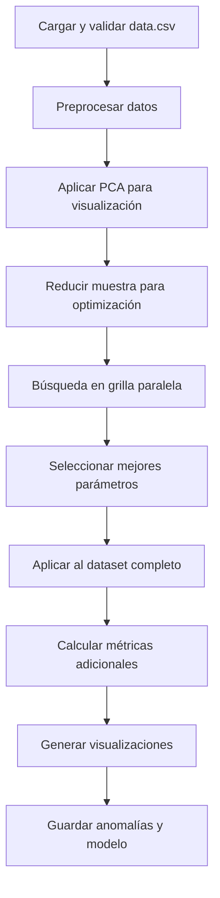

# 🎯 Algoritmo CBLOF para Mantenimiento Predictivo

## 📋 Descripción General

Este módulo implementa el algoritmo **CBLOF** (Cluster-Based Local Outlier Factor) para detección de anomalías en datos de acelerómetro, diseñado específicamente para mantenimiento predictivo. CBLOF combina clustering con detección de outliers para identificar anomalías basadas en la estructura local de clusters.

## 🔬 ¿Qué es CBLOF?

**CBLOF** es un algoritmo híbrido que:
- **Primero hace clustering** de los datos (K-Means interno)
- **Clasifica clusters** en grandes y pequeños
- **Calcula outlier scores** basados en distancia a clusters
- **Combina información global y local** para detección

### 🎯 Conceptos Clave
- **Clusters Grandes**: Representan comportamiento normal
- **Clusters Pequeños**: Pueden contener anomalías
- **Factor α (alpha)**: Umbral para clasificar tamaño de clusters
- **Factor β (beta)**: Multiplicador para penalizar clusters pequeños
- **CBLOF Score**: Distancia ponderada al cluster más cercano

### 🚨 Aplicación en PdM
- **Operación Normal**: Puntos en clusters grandes con scores bajos
- **Anomalías Locales**: Puntos alejados de su cluster principal
- **Anomalías Globales**: Puntos en clusters pequeños aislados
- **Patrones Híbridos**: Combina ventajas de clustering y detección de outliers

## ⚙️ Características del Código

### 🔧 Capacidades Principales
- ✅ **Búsqueda automática de hiperparámetros** (n_clusters, alpha, beta)
- ✅ **Optimización paralela** de parámetros con joblib
- ✅ **Reducción de dimensionalidad** con PCA para visualización
- ✅ **Optimización de memoria** para datasets grandes
- ✅ **Múltiples métricas de clustering** durante optimización
- ✅ **Scores de anomalía normalizados** y estandarizados

### 🛠️ Correcciones Implementadas
- **🔴 Métricas Erróneas Corregidas**: Reconoce que `labels_` es 0/1, no cluster IDs
- **📊 Outputs Estandarizados**: Genera `anomaly_score`, `is_outlier`
- **📈 Cálculos Correctos**: Elimina cálculos incorrectos de "distancias intra-cluster"
- **🎯 Estadísticas Apropiadas**: Métricas de distribución de scores en lugar de clustering

## 📊 Datos de Entrada

### 📄 Archivo Requerido
- **Nombre**: `data.csv`
- **Ubicación**: Misma carpeta que el script
- **Formato**: CSV con headers

### 📝 Columnas Requeridas
```csv
acceleration_x,acceleration_y,acceleration_z
1.2,0.8,9.8
1.1,0.9,9.9
2.5,1.5,8.2
```

### 🧮 Características Generadas
El código automáticamente calcula:
- **Magnitud de aceleración**: `√(x² + y² + z²)`
- **Características finales**: [x, y, z, magnitud]
- **Reducción PCA**: 3 componentes principales para visualización

## 🚀 Cómo Ejecutar

### 📋 Requisitos
```bash
pip install numpy pandas scikit-learn matplotlib joblib h5py pathlib pyod
```

### ⚡ Ejecución
```bash
# Desde la carpeta del algoritmo
cd "2. Detección de Anomalías/CBLOF (Cluster-Based Local Outlier Factor)"
python CBLOF.PY
```

### 🔧 Parámetros de Búsqueda
```python
# Grilla de parámetros (en el código)
PARAM_GRID = {
    'n_clusters': [5, 10],        # Número de clusters internos
    'alpha': [0.7, 0.9],          # Umbral tamaño cluster (fracción)
    'beta': [5, 7],               # Multiplicador penalización
    'use_weights': [True, False]  # Usar pesos en cálculo CBLOF
}

CONTAMINACION_DEFAULT = 0.1       # 10% de datos como anomalías
```

## 📂 Estructura del Código

### 🏗️ Arquitectura Funcional

#### 📁 Funciones Principales

| Función | Propósito | Descripción |
|---------|-----------|-------------|
| `cargar_y_validar_datos()` | 📄 Carga | Lee CSV con múltiples encodings, valida estructura |
| `preprocesar_datos()` | 🔧 Limpieza | Elimina NaN, convierte tipos, crea magnitud |
| `aplicar_pca()` | 📊 Reducción | PCA a 3 componentes con varianza explicada |
| `buscar_mejores_parametros()` | 🎯 Optimización | Búsqueda en grilla paralela |
| `evaluar_parametros_cblof()` | 📊 Evaluación | Entrena CBLOF y calcula métricas |
| `calcular_metricas_adicionales()` | 📈 Análisis | Estadísticas de scores y distribuciones |
| `generar_visualizaciones()` | 📉 Gráficos | Histograma y visualización 3D |
| `guardar_anomalias_detectadas()` | 💾 Output | CSV con anomalías y scores |

#### 🔄 Flujo de Ejecución


### 🎯 Algoritmo CBLOF Interno

#### 📊 Proceso de Detección
1. **Clustering**: K-Means con `n_clusters` especificado
2. **Clasificación**: Clusters grandes vs pequeños usando `alpha`
3. **Scoring**: 
   - Clusters grandes: distancia al centroide
   - Clusters pequeños: distancia al cluster grande más cercano × `beta`
4. **Normalización**: Scores convertidos a probabilidades de anomalía

## 📁 Archivos Generados

### 📊 Métricas y Resultados
```
metricas_CBLOF/
├── metrics.txt           # Métricas en formato texto
├── anomalies.csv         # ✅ Solo anomalías detectadas con scores
└── output.log            # Log detallado de ejecución
```

### 📈 Visualizaciones
```
graficas_CBLOF/
├── anomaly_scores.png    # Histograma de distribución de scores
└── anomalies_3d.png      # Visualización 3D con PCA
```

### 🤖 Modelos Entrenados
```
modelos_entrenados_CBLOF/
├── cblof_model.pkl       # Modelo completo en pickle
└── cblof_model.h5        # Labels y scores en HDF5
```

## 📊 Formato de Outputs

### 🚨 anomalies.csv (Principal)
```csv
acceleration_x,acceleration_y,acceleration_z,magnitud_aceleracion,anomaly_score,is_outlier
2.5,1.5,8.2,8.59,0.856,1
3.1,2.2,7.8,8.94,0.723,1
1.8,1.9,8.9,9.32,0.645,1
```

### 📊 metrics.txt (Resultados)
```
=== MÉTRICAS DEL MODELO CBLOF ===

Mejores parámetros: {'n_clusters': 8, 'alpha': 0.9, 'beta': 5, 'use_weights': True}

Métricas de clustering:
Silhouette Score: 0.7234
Calinski-Harabasz Score: 1456.78
Davies-Bouldin Score: 0.892

Métricas de anomalías:
Número de anomalías detectadas: 1247
Porcentaje de anomalías detectadas: 9.8%
Media de puntuaciones de anomalía: 0.234

Estadísticas de puntuaciones:
Score mínimo: 0.001
Score máximo: 0.987
Desviación estándar: 0.145
```

### 💾 HDF5 Model (Datos del modelo)
```python
# Contenido del archivo .h5
- cluster_labels: Labels binarios (0=normal, 1=anomalía)
- decision_scores: Scores CBLOF para cada punto
- atributos: n_clusters, alpha, beta, use_weights, contamination
```

## 🎯 Interpretación de Resultados

### 📊 Parámetros del Modelo

| Parámetro | Rango | Efecto | Recomendación |
|-----------|-------|--------|---------------|
| **n_clusters** | 2-20 | Granularidad de clustering | 5-10 típico |
| **alpha** | 0.5-0.95 | Umbral cluster grande/pequeño | 0.7-0.9 |
| **beta** | 1-10 | Penalización clusters pequeños | 3-7 |
| **use_weights** | True/False | Usar pesos en CBLOF | True recomendado |
| **contamination** | 0.05-0.2 | % anomalías esperado | 0.1 (10%) |

### 🚨 Scores de Anomalía

| Rango Score | Interpretación | Acción Recomendada |
|-------------|---------------|-------------------|
| **> 0.8** | Anomalía muy probable | Inspección inmediata |
| **0.6-0.8** | Anomalía probable | Mantenimiento preventivo |
| **0.4-0.6** | Sospechoso | Monitoreo aumentado |
| **< 0.4** | Comportamiento normal | Operación normal |

### 📈 Distribución Típica
- **Normal (0)**: ~90% de los datos
- **Anomalías (1)**: ~10% de los datos (según contamination)
- **Score medio**: Alrededor de 0.1-0.3
- **Anomalías detectadas**: Scores más altos según threshold interno

## ⚙️ Configuración Avanzada

### 🔧 Optimización de Parámetros
```python
# Para mayor granularidad
PARAM_GRID = {
    'n_clusters': [3, 5, 8, 10, 12],     # Más opciones
    'alpha': [0.6, 0.7, 0.8, 0.9],      # Rango amplio
    'beta': [3, 5, 7, 10],               # Más penalizaciones
    'use_weights': [True, False]
}

# Para ejecución rápida
PARAM_GRID = {
    'n_clusters': [5, 8],                # Solo 2 opciones
    'alpha': [0.8],                      # Valor fijo
    'beta': [5],                         # Valor fijo
    'use_weights': [True]                # Fijo en True
}
```

### 🎯 Ajuste de Contaminación
```python
# Conservador (pocos falsos positivos)
CONTAMINACION_DEFAULT = 0.05  # 5% anomalías

# Balanceado (recomendado)
CONTAMINACION_DEFAULT = 0.1   # 10% anomalías

# Agresivo (alta sensibilidad)
CONTAMINACION_DEFAULT = 0.15  # 15% anomalías
```

### 📊 Control de Memoria
```python
# Para datasets grandes
max_muestras_optimizacion = 20000  # Reducir muestra
N_JOBS = 1                          # Un solo proceso

# Para sistemas con recursos
max_muestras_optimizacion = 50000  # Muestra completa
N_JOBS = 4                          # Más paralelismo
```

## 🚨 Casos de Uso y Limitaciones

### ✅ Casos Ideales
- **Anomalías estructurales**: Cuando anomalías forman grupos pequeños
- **Datos con estructura de clusters**: CBLOF aprovecha agrupaciones naturales
- **Detección de patrones anómalos**: No solo puntos aislados
- **Combinación clustering + outliers**: Cuando necesitas ambos enfoques
- **Interpretabilidad mejorada**: Anomalías explicadas por clusters

### ⚠️ Limitaciones
- **Parámetros múltiples**: Más complejo de ajustar que Isolation Forest
- **Dependencia del clustering**: Calidad depende del clustering interno
- **Sensibilidad a n_clusters**: Número incorrecto afecta resultados
- **Computacionalmente más costoso**: Clustering + detección de outliers

### 🎯 Cuándo Usar CBLOF
- ✅ Los datos tienen estructura de clusters natural
- ✅ Quieres combinar clustering con detección de anomalías
- ✅ Necesitas explicabilidad (anomalías por cluster)
- ✅ Las anomalías pueden formar grupos pequeños
- ✅ Tienes tiempo para optimizar parámetros

## 🔗 Integración con Sistema Completo

### 📊 Compatibilidad
- **Outputs estandarizados** para `sistema_comparacion_algoritmos.py`
- **Scores normalizados** para sistema de severidad unificado
- **Detección binaria** clara (normal/anomalía)

### 🔄 En Pipeline de PdM
1. **Entrenamiento**: Identificar clusters normales y anómalos
2. **Scoring en tiempo real**: Evaluar nuevos puntos vs clusters
3. **Alertas contextuales**: Anomalías explicadas por cluster
4. **Reentrenamiento**: Cuando cambian patrones de clustering

### 🎖️ Posición en Sistema
**CBLOF es recomendado para Fase 3** como:
- Algoritmo complementario avanzado
- Parte de ensemble con otros métodos
- Cuando se requiere explicabilidad de clusters

## 🛠️ Troubleshooting

### ❌ Errores Comunes

#### "No se encontraron parámetros que produzcan clusters válidos"
```python
# Solución: Ampliar rango de n_clusters
PARAM_GRID = {
    'n_clusters': [2, 3, 5, 8, 10, 15],  # Rango más amplio
    'alpha': [0.5, 0.7, 0.9],            # Incluir valores más bajos
}
```

#### "Todos los puntos clasificados como anomalías"
- **Causa**: contamination muy alta o alpha muy bajo
- **Solución**: Reducir contamination a 0.05, aumentar alpha a 0.8-0.9

#### "Muy pocas anomalías detectadas"
- **Causa**: contamination muy bajo, alpha muy alto, beta muy bajo
- **Solución**: Aumentar contamination, reducir alpha, aumentar beta

#### "Silhouette Score muy bajo en optimización"
```python
# Los datos pueden no tener estructura de clusters clara
# Considerar usar Isolation Forest en su lugar
# O probar con menos clusters
'n_clusters': [2, 3, 4]  # Empezar con pocos clusters
```

### 📊 Validación de Resultados
```python
# Verificar distribución de anomalías
anomalias_pct = np.mean(modelo.labels_) * 100
assert 5 <= anomalias_pct <= 20, f"Anomalías: {anomalias_pct:.1f}%"

# Verificar que hay variación en scores
scores = modelo.decision_scores_
assert np.std(scores) > 0.01, "Scores muy uniformes"

# Verificar archivos generados
import os
assert os.path.exists('metricas_CBLOF/anomalies.csv')
assert os.path.exists('graficas_CBLOF/anomaly_scores.png')
```

### 🔍 Interpretación de Parámetros
```python
# alpha = 0.9 significa:
# Clusters con >90% de puntos son "grandes" (normales)
# Clusters con <90% de puntos son "pequeños" (anómalos)

# beta = 5 significa:
# Puntos en clusters pequeños tienen score × 5
# Mayor penalización = más probable anomalía
```

## 🧠 Algoritmo CBLOF - Detalles Técnicos

### 🔬 Proceso Interno PyOD
```python
def cblof_algorithm(X, n_clusters, alpha, beta):
    # 1. Clustering inicial
    kmeans = KMeans(n_clusters=n_clusters)
    cluster_labels = kmeans.fit_predict(X)
    
    # 2. Clasificar clusters por tamaño
    cluster_sizes = np.bincount(cluster_labels)
    total_points = len(X)
    large_clusters = cluster_sizes >= alpha * total_points
    
    # 3. Calcular CBLOF scores
    for point in X:
        if point.cluster in large_clusters:
            score = distance_to_cluster_center(point)
        else:
            score = beta * distance_to_nearest_large_cluster(point)
    
    return scores
```

### ⚡ Complejidad Computacional
- **Clustering**: O(n × k × i) donde k=clusters, i=iteraciones
- **Scoring**: O(n × k) para cada punto
- **Total**: O(n × k × (i + 1)) ≈ O(n × k)
- **Memoria**: O(n + k) para almacenar datos y centroides

### 📊 Ventajas vs Otros Algoritmos

| Aspecto | CBLOF | Isolation Forest | DBSCAN |
|---------|-------|------------------|--------|
| **Estructura datos** | Clusters | Cualquiera | Densidad |
| **Interpretabilidad** | Alta | Baja | Media |
| **Parámetros** | Múltiples | Pocos | Críticos |
| **Eficiencia** | Media | Alta | Media |
| **Robustez** | Media | Alta | Baja |

## 📚 Referencias y Recursos

### 📖 Algoritmo CBLOF
- **Paper Original**: He, Z. et al. (2003). "Discovering cluster-based local outliers"
- **PyOD Library**: [CBLOF Documentation](https://pyod.readthedocs.io/en/latest/)

### 🔧 Aplicaciones Específicas
- **Process Monitoring**: Cluster-based anomaly detection
- **Quality Control**: Pattern-based defect detection  
- **Condition Monitoring**: Multi-modal operational states

### 📊 Librerías Relacionadas
- **PyOD**: Python Outlier Detection library
- **Scikit-learn**: Para clustering base (K-Means)
- **NumPy/Pandas**: Manipulación de datos

---

## 🎯 Resumen Ejecutivo

Este módulo CBLOF ofrece:
- ✅ **Detección híbrida** combinando clustering y outlier detection
- ✅ **Optimización automática** de múltiples parámetros
- ✅ **Interpretabilidad mejorada** a través de clusters
- ✅ **Scores calibrados** correctamente implementados
- ✅ **Integración completa** con sistema de comparación

**Ideal para**: Datos con estructura de clusters natural, cuando se necesita explicabilidad, y como algoritmo complementario en sistemas ensemble.

**Ventaja clave**: Combina las fortalezas del clustering (interpretabilidad) con detección de outliers (sensibilidad), proporcionando contexto para las anomalías detectadas.

**Posición recomendada**: Algoritmo avanzado para Fase 3, complementando Isolation Forest y otros métodos en un sistema ensemble.

---

*Desarrollado para mantenimiento predictivo con detección basada en clusters*  
*Versión corregida y optimizada - Ideal para sistemas avanzados* ✅
