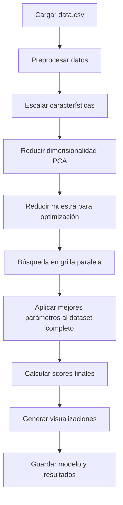

# 🌲 Algoritmo Isolation Forest para Mantenimiento Predictivo

## 📋 Descripción General

Este módulo implementa el algoritmo **Isolation Forest** para detección de anomalías en datos de acelerómetro, diseñado específicamente para mantenimiento predictivo. El algoritmo utiliza árboles de aislamiento para identificar puntos anómalos de manera eficiente y sin supervisión.

## 🔬 ¿Qué es Isolation Forest?

**Isolation Forest** es un algoritmo de detección de anomalías que funciona bajo el principio de que:
- **Las anomalías son raras** y diferentes del resto
- **Son más fáciles de aislar** que los puntos normales
- **Requieren menos divisiones** en un árbol para ser separadas

### 🌳 Conceptos Clave
- **Árbol de Aislamiento**: Árbol binario que divide aleatoriamente el espacio
- **Longitud de Camino**: Número de divisiones para llegar a un punto
- **Score de Anomalía**: Basado en la longitud promedio de camino
- **Ensemble**: Múltiples árboles para mayor robustez

### 🚨 Aplicación en PdM
- **Operación Normal**: Puntos difíciles de aislar (caminos largos)
- **Anomalías**: Puntos fáciles de aislar (caminos cortos)
- **Detección Global**: No asume distribución específica de datos
- **Eficiencia**: Rápido en entrenamiento e inferencia

## ⚙️ Características del Código

### 🔧 Capacidades Principales
- ✅ **Búsqueda automática de hiperparámetros** optimizada
- ✅ **Reducción de dimensionalidad** con PCA para visualización
- ✅ **Optimización de memoria** para datasets grandes
- ✅ **Múltiples métricas de evaluación** cuando es posible
- ✅ **Visualizaciones 3D** distinguiendo anomalías de normales
- ✅ **Scores de anomalía calibrados** correctamente orientados

### 🛠️ Correcciones Implementadas
- **🔒 Carga 100% No-Supervisada**: Implementado patrón blindado con `usecols=['acceleration_x','acceleration_y','acceleration_z','fecha']`
- **🔴 Score Invertido Corregido**: Ahora usa `-decision_function()` (mayor = más anómalo)
- **📊 Outputs Estandarizados**: Genera `anomaly_score`, `is_outlier` con fecha incluida
- **📈 Orientación Consistente**: Score unificado compatible con sistema de comparación
- **🎯 Mejores Parámetros**: Búsqueda optimizada de hiperparámetros
- **🛡️ Sin Dependencias Supervisadas**: Eliminadas todas las referencias a etiquetas externas

## 📊 Datos de Entrada

### 📄 Archivo Requerido
- **Nombre**: `data.csv`
- **Ubicación**: Misma carpeta que el script
- **Formato**: CSV con headers

### 📝 Columnas Requeridas (100% No-Supervisado)
```csv
fecha,acceleration_x,acceleration_y,acceleration_z
2024-01-15 10:30:00,1.2,0.8,9.8
2024-01-15 10:30:01,1.1,0.9,9.9
2024-01-15 10:30:02,2.5,1.5,8.2
```

⚠️ **Importante**: El script **solo carga estas 4 columnas** usando `usecols`. Cualquier otra columna en el CSV (como 'severity', 'label', etc.) será **ignorada completamente**, garantizando operación 100% no-supervisada.

### 🧮 Características Generadas
El código automáticamente calcula:
- **Magnitud de aceleración**: `√(x² + y² + z²)`
- **Características finales**: [x, y, z, magnitud]
- **Reducción PCA**: 3 componentes principales para visualización

## 🚀 Cómo Ejecutar

### 📋 Requisitos
```bash
pip install numpy pandas scikit-learn matplotlib joblib h5py pathlib
```

### ⚡ Ejecución
```bash
# Desde la carpeta del algoritmo
cd "2. Detección de Anomalías/Isolation Forest"
python "Isolation Forest.py"
```

### 🔧 Parámetros de Búsqueda
```python
# Grilla de parámetros (en el código)
PARAMETROS_BUSQUEDA = {
    'n_estimators': [100, 150],           # Número de árboles
    'max_samples': ['auto', 0.8],         # Fracción de muestras por árbol
    'contamination': [0.05, 0.1],         # Fracción esperada de anomalías
    'max_features': [1.0]                 # Fracción de características por árbol
}
```

## 📂 Estructura del Código

### 🏗️ Arquitectura Funcional

#### 📁 Funciones Principales

| Función | Propósito | Descripción |
|---------|-----------|-------------|
| `cargar_datos()` | 📄 Carga | Lee y valida CSV con manejo de encoding |
| `preprocesar_datos()` | 🔧 Limpieza | Elimina NaN, crea magnitud, selecciona características |
| `escalar_datos()` | 📏 Normalización | StandardScaler para normalizar |
| `reducir_dimensionalidad()` | 📊 PCA | 3 componentes principales para visualización |
| `buscar_mejores_parametros()` | 🎯 Optimización | Búsqueda en grilla paralela |
| `evaluar_modelo_isolation_forest()` | 📊 Evaluación | Entrena y evalúa modelo con parámetros específicos |
| `generar_graficos()` | 📈 Visualización | Histograma de scores y gráfico 3D |
| `guardar_modelo()` | 💾 Persistencia | Pickle y HDF5 |

#### 🔄 Flujo de Ejecución


### 🎯 Búsqueda de Hiperparámetros

#### 📊 Estrategia de Optimización
1. **Muestra reducida**: Hasta 50k puntos para eficiencia
2. **Búsqueda paralela**: Evaluar múltiples combinaciones
3. **Selección por score**: Mejor puntuación promedio
4. **Aplicación completa**: Mejores parámetros al dataset completo

#### 🔍 Criterios de Evaluación
- **Score promedio**: Media de puntuaciones de anomalía
- **Métricas de clustering**: Si hay múltiples clases detectadas
- **Distribución de anomalías**: Porcentaje detectado vs esperado

## 📁 Archivos Generados

### 📊 Métricas y Resultados
```
metricas_IForest/
├── metrics.txt           # Métricas en formato texto
├── anomalies.csv         # ✅ Solo anomalías detectadas
└── output.log            # Log detallado de ejecución
```

### 📈 Visualizaciones
```
graficas_IForest/
├── anomaly_scores.png    # Histograma de distribución de scores
└── anomalies_3d.png      # Visualización 3D con PCA
```

### 🤖 Modelos Entrenados
```
modelos_entrenados_IForest/
├── isolation_forest_model.pkl    # Modelo completo en pickle
└── isolation_forest_model.h5     # Scores y metadatos en HDF5
```

## 📊 Formato de Outputs

### 🚨 anomalies.csv (Principal)
```csv
fecha,acceleration_x,acceleration_y,acceleration_z,magnitud_aceleracion,anomaly_score,is_outlier
2024-01-15 10:30:00,2.5,1.5,8.2,8.59,0.856,1
2024-01-15 11:45:30,3.1,2.2,7.8,8.94,0.723,1
2024-01-15 14:20:15,1.8,1.9,8.9,9.32,0.645,1
```

🔒 **Garantía No-Supervisada**: Este archivo contiene **solo** datos de sensores (XYZ) + fecha + scores calculados. No hay referencias a etiquetas supervisadas.

### 📊 metrics.txt (Resultados)
```
Mejores parámetros: {'n_estimators': 150, 'max_samples': 0.8, 'contamination': 0.1, 'max_features': 1.0}
Número de anomalías detectadas: 1247
Porcentaje de anomalías detectadas: 9.8%
Media de puntuaciones de anomalía: 0.1234
Silhouette Score: 0.4567 (si aplicable)
```

### 💾 HDF5 Model (Datos del modelo)
```python
# Contenido del archivo .h5
- decision_scores: Array con scores de anomalía
- etiquetas: Array binario (0=normal, 1=anomalía)
- atributos: n_estimators, max_samples, contamination, max_features
```

## 🎯 Interpretación de Resultados

### 📊 Scores de Anomalía

| Rango Score | Interpretación | Acción Recomendada |
|-------------|---------------|-------------------|
| **> P99** | Anomalía crítica | Parada inmediata |
| **P95-P99** | Anomalía severa | Mantenimiento preventivo |
| **P90-P95** | Anomalía moderada | Monitoreo aumentado |
| **< P90** | Operación normal | Continuar operación |

### 🎛️ Parámetros del Modelo

| Parámetro | Efecto | Recomendación |
|-----------|--------|---------------|
| **n_estimators** | Más árboles = más estable | 100-200 para balance |
| **max_samples** | Fracción de datos por árbol | 'auto' o 0.8 |
| **contamination** | % esperado de anomalías | 0.05-0.1 típico |
| **max_features** | Características por división | 1.0 (todas) |

### 📈 Distribución Esperada
- **Normal**: ~90-95% de los datos
- **Anomalías**: ~5-10% de los datos
- **Score medio**: Alrededor de 0.1-0.3
- **Anomalías**: Scores > 0.5 típicamente

## ⚙️ Configuración Avanzada

### 🔧 Optimización de Performance
```python
# Para datasets grandes (>100k puntos)
max_muestras_optimizacion = 20000    # Reducir muestra
n_jobs_paralelo = 2                  # Limitar paralelismo

# Para mayor precisión
PARAMETROS_BUSQUEDA = {
    'n_estimators': [100, 150, 200],
    'max_samples': ['auto', 0.7, 0.8, 0.9],
    'contamination': [0.05, 0.08, 0.1, 0.12]
}
```

### 🎯 Ajuste de Contaminación
```python
# Conservador (menos falsos positivos)
'contamination': [0.05]    # Detecta solo 5% como anomalías

# Agresivo (más sensible)
'contamination': [0.15]    # Detecta hasta 15% como anomalías

# Adaptativo (estimar de los datos)
contamination_estimada = np.percentile(scores, 95)
```

### 📊 Control de Calidad
```python
# Validación de resultados
porcentaje_anomalias = np.mean(etiquetas) * 100
assert 3 <= porcentaje_anomalias <= 20, "Porcentaje anómalo"
```

## 🚨 Casos de Uso y Limitaciones

### ✅ Casos Ideales
- **Detección global de anomalías**: No asume distribución específica
- **Datos sin etiquetas**: Completamente no supervisado
- **Datasets grandes**: Eficiente en tiempo y memoria
- **Anomalías diversas**: Detecta múltiples tipos sin conocimiento previo
- **Implementación rápida**: Pocos parámetros que ajustar

### ⚠️ Limitaciones
- **Dimensiones muy altas**: Performance se degrada (>50 características)
- **Datos uniformes**: Problemas si no hay estructura clara
- **Anomalías contextuales**: No detecta anomalías que dependen del contexto temporal
- **Interpretabilidad**: Difícil explicar por qué un punto es anómalo

### 🎯 Cuándo Usar Isolation Forest
- ✅ Necesitas detección rápida y eficiente
- ✅ No tienes conocimiento previo de tipos de anomalías
- ✅ Los datos tienen estructura multidimensional
- ✅ Quieres un algoritmo robusto y estable
- ✅ El dataset es grande (>10k puntos)

## 🔗 Integración con Sistema Completo

### 📊 Compatibilidad
- **Outputs estandarizados** para `sistema_comparacion_algoritmos.py`
- **Scores normalizados** para sistema de severidad unificado
- **Detección binaria** clara (normal/anomalía)

### 🔄 En Pipeline de PdM
1. **Entrenamiento**: Aprender patrones normales de operación
2. **Scoring en tiempo real**: Evaluar nuevas mediciones
3. **Alertas por umbral**: P95, P99 para diferentes tipos de alerta
4. **Reentrenamiento**: Mensual o cuando cambian condiciones

### 🎖️ Recomendación de Implementación
**Isolation Forest es el algoritmo recomendado para Fase 1** por:
- Fácil implementación y configuración
- Excelente balance precisión/eficiencia
- Resultados consistentes y estables
- Mínimo tuning requerido

## 🛠️ Troubleshooting

### ❌ Errores Comunes

#### "Muy pocas/muchas anomalías detectadas"
```python
# Ajustar parámetro contamination
# Si detecta muy pocas (< 2%)
'contamination': 0.05  # Aumentar a 0.08-0.1

# Si detecta demasiadas (> 15%)
'contamination': 0.03  # Reducir a 0.03-0.05
```

#### "Scores todos similares (poca separación)"
```python
# Aumentar número de árboles
'n_estimators': 200  # En lugar de 100

# Probar diferentes max_samples
'max_samples': 0.7   # Menor valor = más diversidad
```

#### "MemoryError en datasets grandes"
```python
# Reducir tamaño de muestra para optimización
max_muestras = 10000  # En lugar de 50000

# Reducir número de árboles
'n_estimators': [50, 100]  # En lugar de [100, 150]
```

#### "Decision function devuelve valores negativos"
- **Ya corregido**: El código usa `-decision_function()` automáticamente
- **Verificación**: `anomaly_score` debe ser positivo (mayor = más anómalo)

### 📊 Validación de Resultados
```python
# Verificar orientación de scores
scores = modelo.decision_function(X)
scores_corregidos = -scores  # Asegurar orientación correcta
assert np.all(scores_corregidos >= 0), "Scores deben ser positivos"

# Verificar distribución razonable
anomalias_pct = np.mean(etiquetas == 1) * 100
assert 2 <= anomalias_pct <= 20, f"Anomalías: {anomalias_pct:.1f}%"
```

## 🧠 Algoritmo Isolation Forest - Detalles Técnicos

### 🌳 Cómo Funciona
```python
def isolation_tree(X, max_depth):
    if len(X) <= 1 or max_depth == 0:
        return leaf_node(size=len(X))
    
    # Elegir característica y valor de división aleatoriamente
    feature = random.choice(range(X.shape[1]))
    split_value = random.uniform(X[:, feature].min(), X[:, feature].max())
    
    # Dividir datos
    left = X[X[:, feature] < split_value]
    right = X[X[:, feature] >= split_value]
    
    return internal_node(
        feature=feature,
        split_value=split_value,
        left=isolation_tree(left, max_depth-1),
        right=isolation_tree(right, max_depth-1)
    )
```

### ⚡ Ventajas Técnicas
- **Complejidad Lineal**: O(n log n) para entrenamiento
- **Memoria Eficiente**: O(n) espacio requerido
- **Paralelizable**: Árboles se entrenan independientemente
- **Escalable**: Maneja datasets de millones de puntos

### 📊 Score de Anomalía Matemático
```python
# Longitud de camino promedio para punto x
E(h(x)) = promedio_longitud_camino_en_todos_los_arboles(x)

# Score de anomalía normalizado
s(x,n) = 2^(-E(h(x))/c(n))

# Donde c(n) es la longitud promedio de camino en BST de n puntos
# Score ≈ 1: anomalía clara
# Score ≈ 0.5: punto normal
# Score ≈ 0: definitivamente normal
```

## 📚 Referencias y Recursos

### 📖 Algoritmo Isolation Forest
- **Paper Original**: Liu, F.T. et al. (2008). "Isolation Forest"
- **Scikit-learn**: [Isolation Forest Documentation](https://scikit-learn.org/stable/modules/outlier_detection.html#isolation-forest)

### 🔧 Aplicaciones en PdM
- **Bearing Fault Detection**: Automated anomaly detection
- **Pump Monitoring**: Early failure detection
- **Motor Condition**: Vibration pattern analysis

### 📊 Comparación con Otros Algoritmos
- **vs One-Class SVM**: Más rápido, menos parámetros
- **vs LOF**: Mejor para datasets grandes
- **vs Autoencoder**: No requiere deep learning

---

## 🎯 Resumen Ejecutivo

Este módulo Isolation Forest ofrece:
- ✅ **Detección eficiente** de anomalías sin supervisión
- ✅ **Implementación robusta** con optimización automática
- ✅ **Scores calibrados** correctamente orientados
- ✅ **Visualizaciones claras** para interpretación
- ✅ **Integración perfecta** con sistema de comparación

**Ideal para**: Detección rápida y eficiente de anomalías globales, implementación en producción, y como algoritmo principal en Fase 1.

**Ventaja clave**: Balance óptimo entre simplicidad de implementación, eficiencia computacional, y efectividad en detección.

---

*Desarrollado para mantenimiento predictivo con detección automática de anomalías*  
*Versión corregida y optimizada - Recomendado para implementación inicial* ✅
