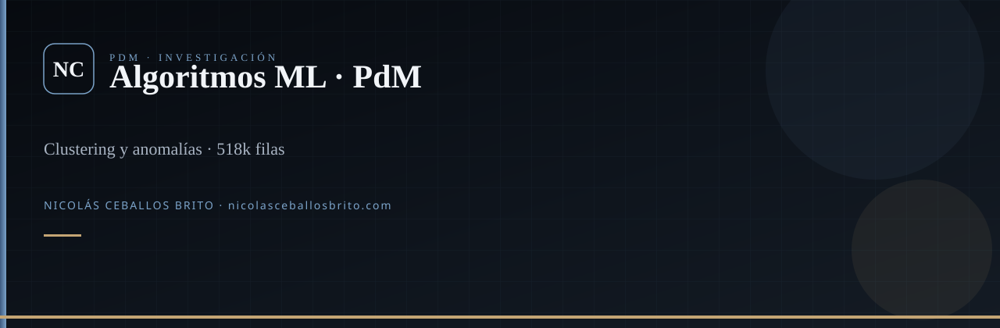

<div align="center">
  
</div>

<br />

<div align="center">

**Investigación** del cuarteto PdM: cuatro algoritmos no supervisados sobre 518 400 filas de acelerómetro.

[](https://scikit-learn.org/)
[](https://pyod.readthedocs.io/)

</div>

## Qué es

Pipeline reproducible (`config.py` + `run_all.ps1`) que compara clustering y detección de anomalías para decidir qué llevar a producción. El motor en vivo es un RNN en [PdM-Manager](https://github.com/Nico2603/PdM-Manager); este repo es el laboratorio.

## Resultado que defiende el repo

En las corridas documentadas: **K-Means** gana clustering y **Isolation Forest** gana anomalías (frente a DBSCAN y CBLOF). Semilla y sampling están en `config.py`.

## Arranque

```bash
git clone https://github.com/Nico2603/Algoritmos-de-ML-no-supervisados-para-PdM.git
cd Algoritmos-de-ML-no-supervisados-para-PdM
python -m venv .venv
.venv\Scripts\activate
pip install -r requirements.txt
.\run_all.ps1
```

Salidas: `graficas_*`, `metricas_*`, `modelos_entrenados_*`.

## Familia

[Arduino-PdM](https://github.com/Nico2603/Arduino-PdM) · [PdM-Manager](https://github.com/Nico2603/PdM-Manager) · **algoritmos** · [landing](https://github.com/Nico2603/PdM_Landing-Page)

## Agentes

`.agents/skills/` — Superpowers, `nicolas-identity`, `find-skills`, `machine-learning`. `graphify update .`

---

<div align="center">

**Nicolás Ceballos Brito** · Ingeniero en Sistemas y Telecomunicaciones (UCP 2025)  
CTO · Prosavis · Pereira, Colombia

[nicolasceballosbrito.com](https://nicolasceballosbrito.com)
·
[GitHub](https://github.com/Nico2603)
·
[LinkedIn](https://www.linkedin.com/in/nicolas-ceballos-brito/)
·
[X](https://x.com/NicolasCBrito)
·
[Instagram](https://www.instagram.com/nico_ceballos26/)
·
[Hugging Face](https://huggingface.co/Flackoooo)
·
[Email](mailto:nicolasceballosbrito@gmail.com)

</div>
